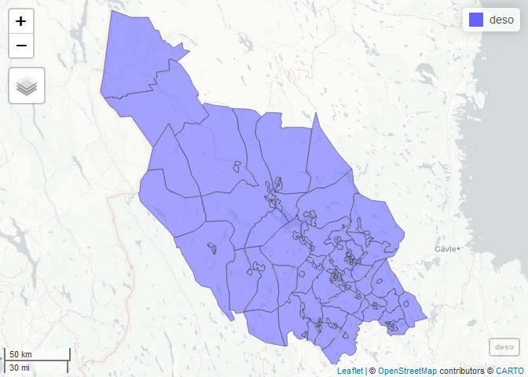
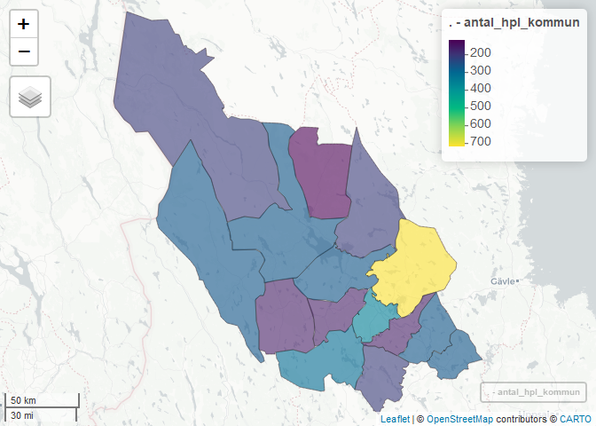
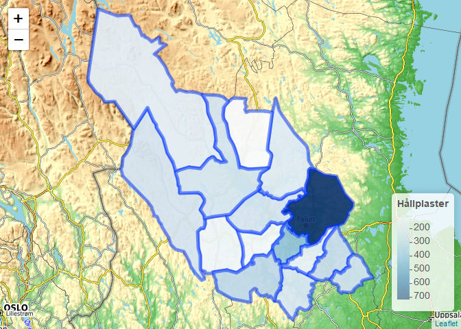
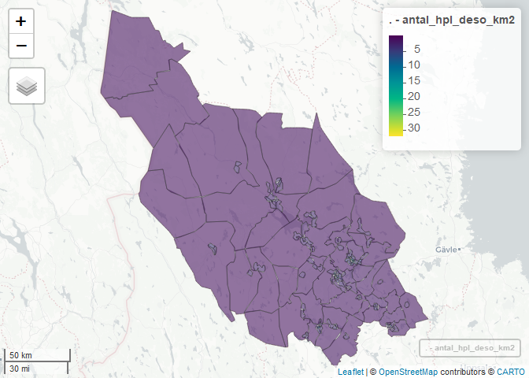

Trafiklab GTFS data
================

``` r
#---------------------------------------------------------------------------------------------------
# set up
#---------------------------------------------------------------------------------------------------

# clean
rm(list = ls())
invisible(gc())


options(dplyr.summarise.inform = FALSE)


# libraries
if (!require("pacman")) install.packages("pacman")
pacman::p_load(tidyverse, sf, sp, httr, mapview, leaflet)


# avoid scientific notation
options(scipen=999)


# create directory
dir.create("data_input")
dir.create("data_output")
dir.create("output")


wd = getwd()

data_input = paste0(wd,"/data_input")
data_output = paste0(wd,"/data_output")
output = paste0(wd,"/output")

# path to github for shapefiles
folder_github = "https://github.com/bjornsh/gis_data/raw/main/"
```

``` r
### url for GTFS
# Specify RKM. 

rkm = "dt" # !!!!!! Specify RKM. Available values : sl, ul, sormland, otraf, krono, klt, gotland, blekinge, skane, halland, vt, varm, orebro, vl, dt, xt, dintur, sj

lan_kod = "20" # !!!!!! Specify län kod, Uppsala = 03, Dalarna = 20


# todays date, used as filter
today = str_remove_all(Sys.Date(), "-")


## Trafiklab key
# api_fil <- read_file(paste0("Z:/api"))
# trafiklab_key = gsub('^.*trafiklab_gtfsstatik: \\s*|\\s*\r.*$', "", api_fil)
trafiklab_key = rstudioapi::askForPassword()
```

``` r
#---------------------------------------------------------------------------------------------------
# Fetch GTFS data 
#---------------------------------------------------------------------------------------------------

## static GTFS timetable data from Trafiklab
url <- paste0("https://opendata.samtrafiken.se/gtfs/", rkm, "/", rkm, ".zip?key=", trafiklab_key)

GET(url, write_disk(paste0(data_input, "/trafiklab_", rkm, ".zip"), overwrite=TRUE))
```

``` r
unzip(paste0(data_input, "/trafiklab_", rkm, ".zip"), exdir = paste0(data_input, "/trafiklab_", rkm))
```

``` r
#---------------------------------------------------------------------------------------------------
# Fetch DeSO and filter shapefile 
#---------------------------------------------------------------------------------------------------
url_shp = paste0(folder_github, "scb/deso/deso_2018_v2.zip")
download.file(url_shp, destfile = paste0(data_input, "/deso_2018_v2.zip"))
unzip(paste0(data_input, "/deso_2018_v2.zip"), exdir = data_input)

deso = st_read(paste0(data_input, "/DeSO_2018_v2.gpkg"))

deso = filter(deso, lan == lan_kod) # extract data for Uppsala län

mapview(deso)
```

<!-- -->

 

``` r
#---------------------------------------------------------------------------------------------------
# Create kommun boundaries based on DeSo boundaries 
#---------------------------------------------------------------------------------------------------
kommun = deso %>% 
  filter(substr(kommun, 1, 2) == lan_kod) %>% 
  group_by(kommun, kommunnamn) %>% 
  summarize(sp_geometry = st_union(sp_geometry)) %>% 
  ungroup()

mapview(kommun)
```

<!-- -->

 

``` r
#---------------------------------------------------------------------------------------------------
# load data
#---------------------------------------------------------------------------------------------------

routes = read.csv2(paste0(data_input, "/trafiklab_", rkm, "/routes.txt"), 
                   sep = ",", encoding="UTF-8", stringsAsFactors=FALSE)

stops = read.csv2(paste0(data_input, "/trafiklab_", rkm, "/stops.txt"), 
                  sep = ",", encoding="UTF-8", stringsAsFactors=FALSE)

stop_times = read.csv2(paste0(data_input, "/trafiklab_", rkm, "/stop_times.txt"), 
                       sep = ",", encoding="UTF-8", stringsAsFactors=FALSE)

trips = read.csv2(paste0(data_input, "/trafiklab_", rkm, "/trips.txt"), 
                  sep = ",", encoding="UTF-8", stringsAsFactors=FALSE)

calendar_dates = read.csv2(paste0(data_input, "/trafiklab_", rkm, "/calendar_dates.txt"), 
                           sep = ",", encoding="UTF-8", stringsAsFactors=FALSE)

# linjenät koordinater
shapes = read.csv2(paste0(data_input, "/trafiklab_", rkm, "/shapes.txt"), 
                           sep = ",", encoding="UTF-8", stringsAsFactors=FALSE)

### Create filter variables

# service_id för rätt datum
service_id_inklud = calendar_dates %>% filter(date == today) %>% select(service_id) %>% pull()

# trips för rätt datum
trips_inklud = trips %>% filter(service_id %in% service_id_inklud) %>% select(trip_id) %>% pull()


#---------------------------------------------------------------------------------------------------
# Merge gtfs tables
#---------------------------------------------------------------------------------------------------

gtfs = stop_times %>%  
  left_join(., trips, by = "trip_id") %>%
  left_join(., stops, by = "stop_id") %>%
  left_join(., routes, by = "route_id") %>%
  mutate(hpl_id = substr(stop_id, 8, 13)) %>% 
  filter(trip_id %in% trips_inklud) %>%  # remove all rows referring to other dates
  distinct(arrival_time, departure_time, stop_id, .keep_all= TRUE) # remove duplicates
```

``` r
#---------------------------------------------------------------------------------------------------
# Data hantering
#---------------------------------------------------------------------------------------------------

antal_departure = gtfs %>% 
  group_by(hpl_id) %>% 
  summarise(antal_dep = n())

antal_linjer = gtfs %>% 
  distinct(hpl_id, route_short_name) %>% 
  group_by(hpl_id) %>% 
  summarise(antal_linjer = n())


## Tidtabelldata är på hållplatslägenivå. Ta medel för att skapa en koordinat per hållplats
hpl_koord = gtfs %>% 
  group_by(hpl_id, stop_name) %>% 
  summarise(lat = round(mean(as.numeric(stop_lat)), 5), lon = round(mean(as.numeric(stop_lon)), 5)) %>% 
  ungroup() %>% 
  left_join(antal_departure, by = "hpl_id") %>% 
  left_join(antal_linjer, by = "hpl_id") %>% 
  mutate(antal_dep_log = log10(as.numeric(antal_dep)))

# create SF object
xy_gtfs = hpl_koord[,c("lon", "lat")]

spdf <- SpatialPointsDataFrame(coords = xy_gtfs, data = hpl_koord) # create spatial points

spdf1 = st_as_sf(spdf) %>% # convert to sf object
  st_set_crs(4326) %>% # set WGS84 as CRS
  st_transform(3006) %>%  # convert to SWEREF99 for intersect with shapefiles
  st_join(., deso) %>% # intersect with DeSO
  select(-kommun, -lan, -kommunnamn, -lannamn) %>% 
  st_join(., kommun) %>% # intersect with kommun
  filter(!is.na(kommunnamn)) # remove hållplatser outside länet
```

 

# Antal unika linjer per hållplats per vardagsdygn

``` r
mapview(spdf1, zcol = "antal_linjer")
```

<!-- -->

 

# Antal avgångar (log10) per hållplats per vardagsdygn

``` r
mapview(spdf1, zcol = "antal_dep_log")
```

<!-- -->

 

# Antal hållplatser per kommun

``` r
kommun %>% 
  left_join(., 
            spdf1 %>% 
              as.data.frame() %>% 
              group_by(kommunnamn) %>% 
              summarise(antal_hpl_kommun = n()) %>% 
              filter(!is.na(kommunnamn)), by = "kommunnamn") %>% 
  mapview(., zcol = "antal_hpl_kommun")
```

<!-- -->

# Same map but with leaflet package which gives more control

``` r
karta_kommun = kommun %>% 
  left_join(., 
            spdf1 %>% 
              as.data.frame() %>% 
              group_by(kommunnamn) %>% 
              summarise(antal_hpl_kommun = n()) %>% 
              filter(!is.na(kommunnamn)), by = "kommunnamn") %>%
  st_transform(4326) 
  

pal <- colorNumeric(
  palette = "Blues",
  domain = karta_kommun$antal_hpl_kommun)


leaflet(karta_kommun) %>%
  addTiles(urlTemplate = 'http://{s}.tile.opentopomap.org/{z}/{x}/{y}.png') %>%
    addPolygons(fillColor = ~pal(antal_hpl_kommun),
                fillOpacity = 0.9,
                popup = ~paste(antal_hpl_kommun, "hållplatser finns i", kommunnamn, "kommun")) %>%   
  addLegend(pal = pal, 
            values = ~antal_hpl_kommun, 
            # labFormat = labelFormat(suffix = "%",
            #                         transform = function(x) 100 * x),
            title = "Hållplaster", position = "bottomright")
```

<!-- -->

``` r
# Leaflet map for export as image

export_karta_kommun = leaflet(karta_kommun) %>%
  addTiles(urlTemplate = 'http://{s}.tile.opentopomap.org/{z}/{x}/{y}.png') %>%
    addPolygons(fillColor = ~pal(antal_hpl_kommun),
                fillOpacity = 0.9) %>% 
  addLegend(pal = pal, 
            values = ~antal_hpl_kommun, 
            # labFormat = labelFormat(suffix = "%",
            #                         transform = function(x) 100 * x),
            title = "Hållplaster", position = "bottomright")

mapshot(export_karta_kommun, file = paste0(output, "/karta_kommun_hpl.png"))
```

 

# Antal hållplatser per DeSO

``` r
deso %>% 
  left_join(., 
            spdf1 %>% 
              as.data.frame() %>% 
              group_by(deso) %>% 
              summarise(antal_hpl_deso = n()) %>% 
              filter(!is.na(deso))  # remove hpl outside län
              #arrange(antal_hpl_deso)
              , by = "deso") %>% 
  mutate(antal_hpl_deso = replace_na(antal_hpl_deso, 0)) %>%  # join shows DeSO without hpl, assign value "0"
  mapview(., zcol = "antal_hpl_deso")
```

<!-- -->

 

# Antal hållplatser per km2 DeSO yta

``` r
deso %>% 
  mutate(area_km2 = round(as.numeric(sub(" .*", "", st_area(.) / 1000000)), 2)) %>% 
  left_join(., 
            spdf1 %>% 
              as.data.frame() %>% 
              group_by(deso) %>% 
              summarise(antal_hpl_deso = n()) %>% 
              filter(!is.na(deso))  # remove hpl outside län
              #arrange(antal_hpl_deso)
              , by = "deso") %>% 
  mutate(antal_hpl_deso = replace_na(antal_hpl_deso, 0),
         antal_hpl_deso_km2 = antal_hpl_deso / area_km2) %>%  # join shows DeSO without hpl, assign value "0"
  mapview(., zcol = "antal_hpl_deso_km2")
```

<!-- -->

## Line network

``` r
# En linje kan följa olika vägsträckor. Här identifieras den vanligaste vägsträckan per linje

line_shapeid = gtfs %>% 
  group_by(route_short_name, shape_id) %>% 
  summarise(n = n()) %>% 
  filter(n == max(n)) %>% # det kan finnas 
  ungroup() %>% 
  select(-n)

shapeid_inklud = line_shapeid %>% select(shape_id) %>% pull()

# create SF object
xy_shapes = shapes %>%
  filter(shape_id %in% shapeid_inklud) %>% 
  select("shape_pt_lon", "shape_pt_lat") %>% 
  mutate_if(is.character,as.numeric)

# create spatial points
sp_shapes <- SpatialPointsDataFrame(coords = xy_shapes, 
                                    data = filter(shapes,shape_id %in% shapeid_inklud)) # must be same nrow as xy_shapes


sp_shapes1 = st_as_sf(sp_shapes) %>% # convert to sf object
#  filter(shape_id == "1" | shape_id == "3") %>% # CREATE TEST DATA
  st_set_crs(4326) %>% # set WGS84 as CRS
  st_transform(3006) # convert to SWEREF99 for intersect with shapefiles

# mapview(sp_shapes1)

all_lines = sp_shapes1 %>% 
  group_by(shape_id) %>% 
  summarise(do_union = FALSE) %>% 
  st_cast("LINESTRING") %>% 
  left_join(., line_shapeid, by = "shape_id")


#### lägg till tätorts (>= 90% hpl inom tätort) vs regiontrafik (< 90% hpl inom tätort) 


mapview(all_lines)
```

<!-- -->
